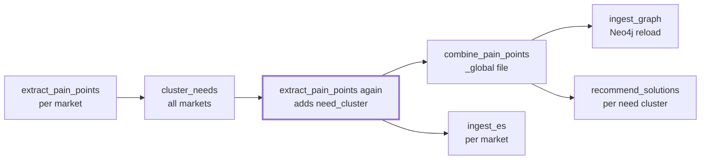

# Proposal: step caching, cross-flow pipelines, live progress

*Status: draft · 2026-10-02 · Author: Antonio Banaag II*

## Summary

DogYard should add three features: a step result cache keyed by input hash, pipelines that run several flows in order, and live progress with an ETA. Do the cache first. It replaces the most code that users currently write themselves.

The evidence comes from **pain-point-miner**, a project that runs 10 DogYard flows: web scraping, LLM analysis (via an `exec-llm` CLI), embedding and clustering, recommendations, and Elasticsearch and Neo4j ingest. So far it has done 178 analyzer runs and 100 scraper runs, mostly long serial `map` runs over LLM and browser calls.

| # | Proposal | What users do today | Impact |
| --- | --- | --- | --- |
| 1 | Step caching keyed by input | Six different skip-if-done schemes in shell and jq | Highest: removes custom code and its bugs |
| 2 | Pipelines across flows | Run order written out in prose, run by hand | High: no more stale outputs downstream |
| 3 | Live progress and ETA | Scripts print their own `[i/N]` lines | Medium: easy to build, used on every long run |

## Proposal 1: step caching keyed by input

A step, or a single `map` item, should be able to reuse an earlier successful result when its input and declared dependencies haven't changed. Today `resume` only helps inside one run, and it refuses if `flow.yaml` changed. So every flow that makes expensive calls has built its own skip logic.

### What pain-point-miner built itself

| Flow / step | Skip rule | Extra knobs it needed |
| --- | --- | --- |
| analyzer `load_posts` / `analyze_posts` | URL not yet in `analysis.jsonl`, compared after URL canonicalization, then checked again before the LLM call | Delete output lines by hand to re-analyze |
| analyze_community | `community_id` not yet in `communities_analysis.jsonl` | Same |
| scraper `scrape_results` | `post.url` not yet in `contents.jsonl`, using a `jq -en 'first(inputs…)'` workaround | None |
| recommend_solutions `recommend` | Last line has the same `brief_sha1` + `prompt_sha1` | `force`, `save: false`, and evals must never skip |
| recommend_solutions `find_alternatives` | Cached by `basis_sha1`, with a TTL | `search`, `refresh_alternatives`, `ALTERNATIVES_TTL_DAYS` |
| cluster_needs `label_clusters` | Top-15 member overlap of 50% or more | Move the label file aside to redo everything |

Each of these does the same job: if this input, with this prompt and config, already succeeded, return the earlier output. Each one also had its own bugs, such as URL-variant duplicates and the multi-line `jq -e` trap (`-e` reflects only the last input).

### Proposed design

```yaml
recommend:
  type: map
  over: steps.build_brief.output
  step:
    type: command
    command: ["./recommend.sh"]
    cache:
      key: '{ "brief": $ }'            # JSONata over the step input; default = the whole input
      files: [config/system.md, config/*.schema.json, recommend.sh]   # hashed into the key
      env: [RECOMMEND_SYSTEM]           # env vars that change behaviour
      ttl: 90d                          # optional
      scope: project                    # project (default) | flow | run
```

- **Key**: the sha256 of the resolved `key` value, the step's `command` argv, the contents of `files`, the `env` values, and the step definition. Editing the prompt or script invalidates the cache with no extra bookkeeping.
- **Store**: `.dogyard/cache/<flow>/<step>/<key>.json` holds `{output, created_at, run_id, duration_ms}`. It sits outside `.runs/`, so a fresh run can use it.
- **Map items**: each item is cached on its own. If 3 of 300 items are new, only those 3 run.
- **Only success is cached**: `failed` and `caught` results are never stored, so failures retry on the next run.
- **Trace**: a new `cached` status with the key and the source `run_id`. `runs show` reports `N cached / M executed`.
- **CLI**: `--no-cache`, `--refresh <step>[,<step>]`, and `dogyard cache ls|clear <flow> [--step]`. Evals and tests skip the cache by default, with `--cache` to opt in.
- **Side effects**: a step that appends to a file still needs its own idempotence. The cache only skips the command. The docs should say so plainly.

### What it would remove from pain-point-miner

- The `brief_sha1` / `prompt_sha1` comparison and the `force` flag in `recommend.sh`.
- The TTL and `basis_sha1` cache in `find-alternatives.sh`.
- The "not yet analyzed" filtering in `load-posts.sh` and `load-communities.sh`, if the map is keyed on the canonical URL / `community_id`. The output files would then be built from step outputs, not append-only logs.
- The `prompt_sha1` field, which records which prompt produced a line. The cache key already records it.

### Open questions

- Should the cache be keyed on a canonicalized input (a `key` expression), as above, or always the full input? URL variants need the expression form.
- When the store gets large, clean it up by LRU, by TTL, or only by hand?
- Can a cached output be "materialized" (e.g. rebuild an output file from the cache), or is that left to the flow?

## Proposal 2: pipelines across flows

DogYard should be able to run several flows in a declared order and rerun only the ones whose inputs are stale. Today pain-point-miner's flows share data only through files, and the order is a sentence in its CLAUDE.md. If a step is skipped, outputs downstream go stale and nothing warns you. For example, `need_cluster` stays null in the global file if `extract_pain_points` doesn't run a second time.



The repeated `extract_pain_points` is the step people forget. A pipeline flow would encode these arrows.

### Proposed design

This comes in two parts that build on each other.

**A. A `flow` step type (subflow).** It runs another flow as one step. Its trigger comes from JSONata and its output is the child flow's output. The child gets its own trace, linked from the parent's.

```yaml
steps:
  extract:
    type: map
    over: '["ph","sg","au"]'
    step: { type: flow, flow: ../extract_pain_points, input: '{ "query": $ }' }
  cluster:  { type: flow, flow: ../cluster_needs, needs: [extract] }
  rejoin:   { type: map, needs: [cluster], over: '["ph","sg","au"]',
              step: { type: flow, flow: ../extract_pain_points, input: '{ "query": $ }' } }
  combine:  { type: flow, flow: ../combine_pain_points, needs: [rejoin] }
  graph:    { type: flow, flow: ../ingest_graph, needs: [combine] }
```

**B. Declared file inputs and outputs, so only stale steps rerun.** These are optional fields on any step or flow:

```yaml
reads:  ["data/*/pain_points.jsonl"]
writes: ["data/_global/pain_points.jsonl"]
```

`dogyard run --stale` skips any step whose `writes` are newer than its `reads` and whose definition hasn't changed. Like `make`, it compares file mtimes, or content hashes when Proposal 1 exists. `dogyard validate` warns when a step reads a file that no step in the pipeline writes.

### Semantics

- Resume works across levels. Resuming a parent re-enters a failed child run, using the child's own trace.
- `max_concurrency` and `run_timeout` set on the parent also cap its children.
- `dogyard graph` draws the whole pipeline, with each subflow collapsed or expanded.

### Open questions

- Should pipelines live in `workflows.yaml` at project level, or be ordinary flows that use `type: flow` steps? Ordinary flows are preferred, since that adds no new concept.
- Should a subflow that is called twice in one parent (like `extract_pain_points` above) get separate cache and trace names automatically?

## Proposal 3: live progress and ETA

While a run is going, DogYard should show how many items are done and how long the rest will take. It should also let a second terminal follow the run. pain-point-miner's long runs are serial `map` steps (`max_concurrency: 1`) over LLM and browser calls, and per-item times vary widely: about 7 s per search, about 30 s per alternatives lookup, and around 87 s per recommendation. Right now the only progress display is one that a step script builds itself. It prints `[i/N] <cluster_id> … in 87s` and needs `index` and `total` passed in through the map input.

### Proposed design

- **A live status line** on the TTY for each running `map`: `analyze_posts  142/300  ● 3 failed  ● 2 caught  ● 40 cached  ETA 1h12m`. On a non-TTY it prints one line every N items or every 30 s. `-q` turns it off.
- **An ETA** based on the rolling median time of the last 20 executed items, times the items left, divided by `max_concurrency`. Cached items (Proposal 1) don't count toward the median. Before any item has finished, it can seed the estimate from the median of this step's earlier runs, read from old traces.
- **`dogyard runs watch <flow> [run_id|latest]`** follows the trace file from another terminal and shows the same status line, plus the last error and each item's stderr tail. `--json` streams progress events for scripts and a future UI.
- **Item context passed in automatically**: `map` sub-steps get `$item_index` and `$item_total` in JSONata, and `WF_ITEM_INDEX` / `WF_ITEM_TOTAL` in the environment. Scripts would no longer need `index` and `total` in their input.
- **`runs` summary**: `dogyard runs <flow>` adds duration, items done/total and status, so an `interrupted` run stands out with how far it got.

### Open questions

- Should a step be able to report progress *within* itself (e.g. a `::progress 40/100` line on stderr) for long single steps such as an embedding batch?
- Should the ETA account for retries and backoff, or show them separately?

## Smaller requests

| Request | Today | Proposed |
| --- | --- | --- |
| Named trigger parameters | `--query ph` is used as a country code in every flow | `--param country=ph` (repeatable), checked against `trigger_schema` |
| A project root variable | Scripts hard-code `../../../../data/...` | `$DOGYARD_PROJECT_ROOT` in env, and `project.root` in JSONata, from the nearest `workflows.yaml` |
| Tests against the real script | Mocks replace the scripts, so tests only cover DAG wiring | `real: true` tests that run in a temp copy of the project, with fixture files and assertions on files written |

## Suggested order

1. **Progress and ETA (Proposal 3)**: smallest change, since the trace already records each item's state. Users see the benefit right away.
2. **Step caching (Proposal 1)**: the largest benefit. Ship the `cached` trace status and the `--no-cache` / `--refresh` flags with it.
3. **Pipelines (Proposal 2)**: the `type: flow` step first, then `reads`/`writes` staleness, which can use cache hashes once Proposal 1 is in.

Proposal 3 goes first because it is cheap. Proposal 1 is the one to push for if only one gets built.
